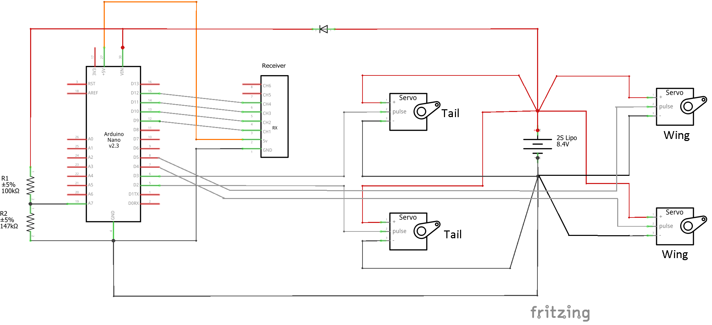

# ServoFlappingControl
This Arduino sketch is the servo controller for an RC ornithopter (Flapping MAV) powered and controlled by two servos. Each servo is connected to a wing and flapped independently.

The program is designed to receive 4 PWM inputs from an RC receiver operating in [MODE 2](https://www.rc-airplane-world.com/rc-transmitter-modes.html) and outputs 4 PWM signals for off-the-shelft hobby servos. Two servos control the wings and two servos control a V-tail.

The aileron (1) and elevator (2) channels are used to modify the motion of the wings and to control the tail. The dihedral angle of the wings is altered in unison with elevator, while the aileron rotates them in opposite directions. Simultaneously, the frequency of the wing-oscillation can be modulated, such that the wings move faster during the downstroke or during the uptroke. Depending on whether this is done symmetrically or assymetrically, one can obtain pitch or roll control. At the same time, the throttle channel (3) control the amplitude of a fixed-frequency oscillation, while the rudder channel (4) assymetrically varies the amplitude of the wings. 

The program was written for an Arduino Nano but it should be compatible with other boards. See the attached schematic for an example of the required circuit:

This video shows what the does controller and how it works:  

