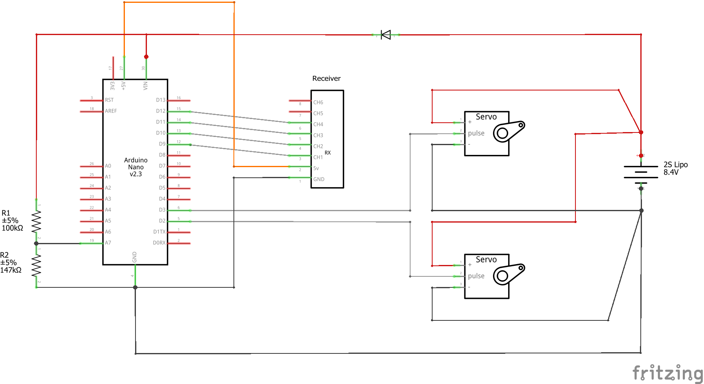

# ServoFlappingControl
This Arduino sketch is the servo controller for an RC ornithopter (Flapping MAV) powered and controlled by two servos. Each servo is connected to a wing and flapped independently.

The program is designed to receive 3 PWM inputs from an RC receiver operating in [MODE 2](https://www.rc-airplane-world.com/rc-transmitter-modes.html) and outputs 2 PWM signals that can be understood by off-the-shelft, hobby grade servos. The aileron (1) and elevator (2) channels are used to bias the dihedral angle of each wing, with the aileron rotating the wings in unison, while the elevator changes the dihedral angle. The throttle channel (3) control the amplitude of a fixed-frequency oscillation. There are 3 wave-forms the user can select: sine wave, triangle wave, and saw wave. MODE 1 can also be used with this program. It is only a matter of swapping the RX connections to the arduino.

Lastly, the controller is equipped with a low-voltage cutoff routine. This will dissable the throttle channel to prevent over-discharging a battery. The routine uses an analog-pin to read the input voltage via a voltage-divider. See the attached schematic for an example of the required circuit.

The program was written for an Arduino Nano but it should be compatible with other boards. It requires the "PinChageInterrupt" library found [here.](https://www.arduino.cc/reference/en/libraries/pinchangeinterrupt/)

For more information on the controller, please see this [post.](https://www.rcgroups.com/forums/showpost.php?p=41325203&postcount=69)

