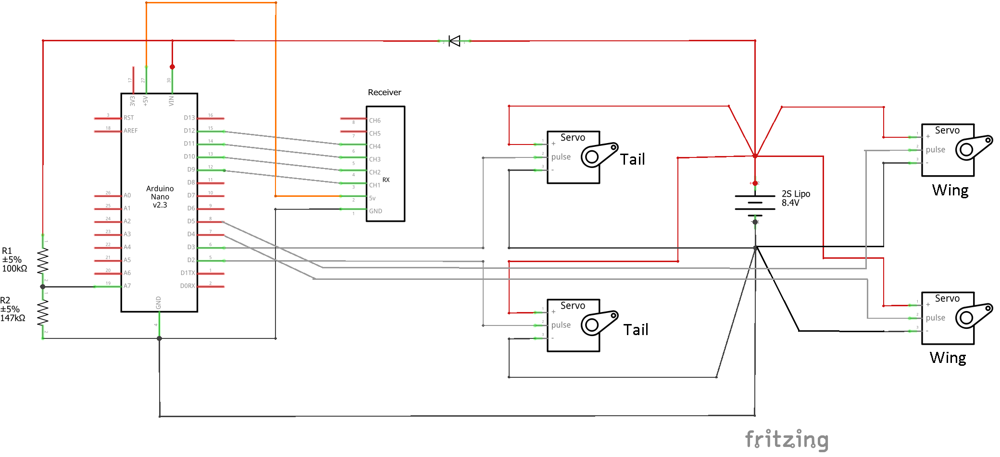
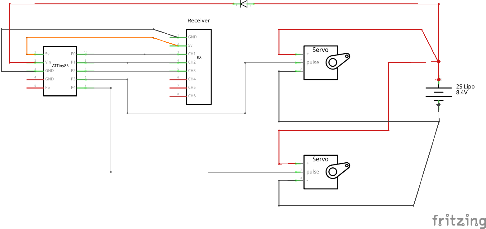

# Servo controller for ornithopter (robot bird) :bird:
This arduino sketch is the servo controller for an RC ornithopter (Flapping MAV) powered and controlled by two servos. Each servo is connected to a wing and flapped independently. It also supports servos to control a tail. 

## How it works
The program is designed to receive 4 PWM inputs from an RC receiver operating in [MODE 2](https://www.rc-airplane-world.com/rc-transmitter-modes.html) and will output 4 PWM signals for off-the-shelf hobby servos. Two servos control the wings and two servos control a V-tail. 

The _aileron (1) and elevator (2)_ channels are used to modify the motion of the wings and to control the tail. The dihedral angle of the wings is altered in unison with the elevator, while the aileron rotates them in opposite directions. Simultaneously, the frequency of the wing-oscillation can be modulated, such that the wings move faster during the downstroke or during the uptroke. Depending on whether this is done symmetrically or assymetrically, one can obtain pitch or roll control. 

The _throttle channel (3)_ controls the amplitude of a fixed-frequency oscillation. By default, the waveform is a triangle-wave, but the throttle can also be used to truncate the wave so it looks more like a square wave. Using a square wave allows the servo to output more mechanical power, but the transition between strokes is very abrupt and stressful. The truncated-wave eases this transition while increasing power compared to a triangle wave.

The _rudder channel (4)_ is used to assymetrically vary the amplitude of the wings. 

## Schematics
__Nano__: While the program was written for an Arduino Nano, it should be compatible with similar boards. If you don't want to use tail servos, simply remove them from the circuit and disable their code using the _parameters.h_ file.

__ATTiny__: As this microcontroller has fewer pins, it does not support tail servos or a rudder channel. Instead the assymetric amplitude can be mixed into the assymetric dihedral. 

## Example
See: [explanation and operation of servo controller](https://youtu.be/T6NfZD_iuEs)  
